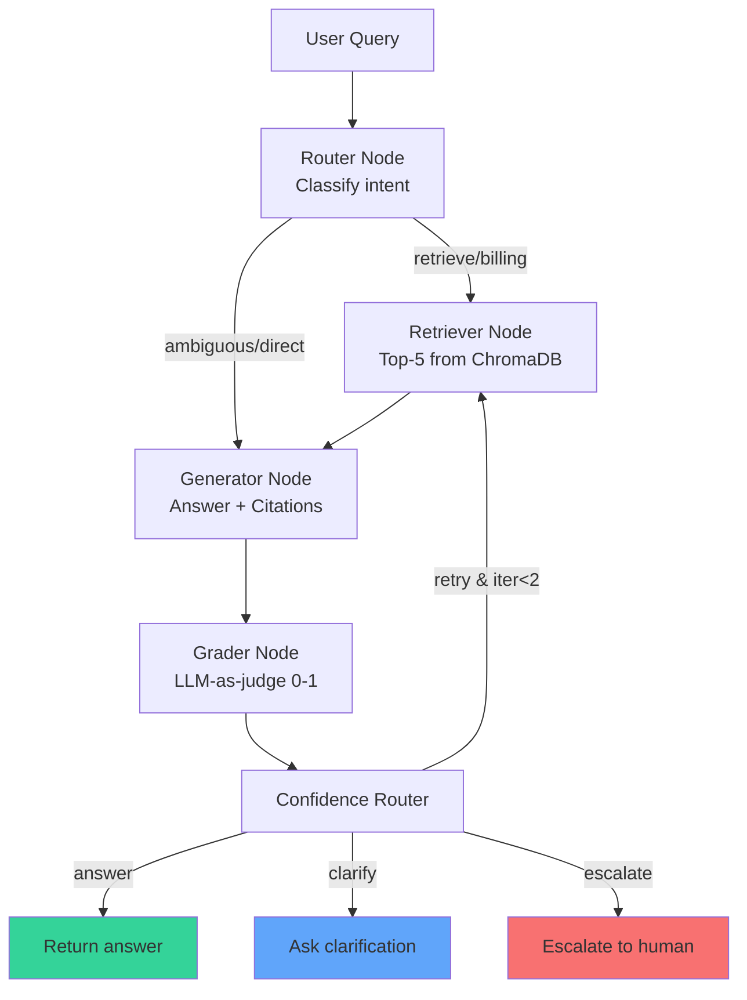

# LearnForge Support Assistant

An agentic RAG customer support assistant for LearnForge (ed-tech), built as a take-home prototype for the Applied AI/LLM Engineer role.

The system answers user questions from an internal knowledge base of FAQs, policies, and past support tickets — while **reducing hallucination**, **handling multi-turn conversations**, and **escalating to humans when not confident**.

## ✨ Key Design Decisions

| Requirement | How it's addressed |
|---|---|
| Reduce hallucination | Every factual claim must cite a source ID (`[FAQ-02]`); a grader node rejects ungrounded answers |
| Multi-turn | Conversation history flows through state; router uses it for context |
| Escalation | Confidence router triggers escalation on low confidence, billing disputes, or repeated grader failures |
| Stale data | Each chunk carries `is_outdated` metadata; generator is instructed to deprioritize outdated sources |
| Contradictions | Unified retrieval surfaces all relevant sources; generator is prompted to surface both sides |
| Ambiguity | Router classifies ambiguous queries (e.g., "Cancel my LearnForge") and asks clarifying questions |

## 🏗️ Architecture



*Every node uses the same LLM (Mistral `open-mistral-nemo`) with a role-specific prompt. The "agency" comes from the graph structure and conditional LLM decisions, not multiple agents.*

## 📊 Data Schema

All three source documents are parsed into a **single ChromaDB collection** with rich metadata. A unified collection is deliberate: contradictions span document types (e.g., FAQ-02 vs TICKET-03 on refund windows), and unified retrieval lets the grader detect them.

| Field | Type | Example | Purpose |
|---|---|---|---|
| `id` | string | `doc_abc123` | Auto-generated chunk ID |
| `page_content` | string | Full section text | The chunk the LLM reads |
| `metadata.source_type` | enum | `"faq"` \| `"policy"` \| `"ticket"` | Enables source-type filtering |
| `metadata.source_id` | string | `"FAQ-02"` | Used for strict citation extraction |
| `metadata.topic` | string | `"refund"` | Semantic grouping |
| `metadata.is_outdated` | bool | `true` | Flagged by phrases like "older version", "obsolete" |
| `metadata.status` | string? | `"escalated"` | For tickets only |
| `metadata.last_reviewed`| string? | `"February 2026"` | For policies only |

## ️ Failure Handling

| Failure Mode | Detection | Mitigation |
|---|---|---|
| **Low-confidence answer** | Grader score < 0.5 | Escalate to human with transcript |
| **Grader fails twice** | `iteration >= 2` and `grade == "fail"` | Escalate; stop retrying to avoid infinite loops |
| **Stale data retrieved** | `metadata.is_outdated == true` | Generator prompt explicitly deprioritizes it; UI shows strikethrough badge |
| **Bad retrieval** | Grader score low + no citations in answer | Retry once with same query; if still failing, escalate |
| **Contradictory sources** | Multiple source IDs on same topic with conflicting claims | Generator is prompted to surface both sides with citations; user decides |
| **Ambiguous query** | Router classifies as `ambiguous` | Ask a clarifying question instead of guessing |
| **Billing dispute** | Router classifies as `billing_dispute` | Always escalate (per policy: support agents shouldn't resolve disputes) |
| **API failure** | Exception during node execution | Caught and returned as a user-friendly error; graph does not crash |

##  Eval Plan

To measure answer quality and hallucination rate in production, I would implement the following evaluation harness:

1. **Hallucination Rate (< 5% target)**: Use an LLM-as-a-judge (e.g., RAGAS or LangSmith) on a held-out set of 50 Q&A pairs. The judge checks if every factual claim in the generated answer is supported by the cited chunks.
2. **Citation Accuracy (> 90% target)**: Verify that every `[SOURCE-ID]` in the output actually exists in the retrieved context and supports the adjacent claim.
3. **Escalation Precision/Recall (> 85% target)**: Manually label 30 historical tickets as "should escalate" or "should not escalate" and compare against the system's `action` output.
4. **Retrieval MRR@5 (> 0.75 target)**: Measure the Mean Reciprocal Rank of the correct FAQ/policy in the top-5 retrieved documents for 30 known question→source mappings.
5. **Staleness Detection (> 95% target)**: Ground-truth manual review of all chunks to ensure outdated markers are correctly flagged during ingestion.

## ️ Trade-offs

### Why Mistral AI over Groq/Gemini/OpenAI?
**Choice:** `mistral-embed` + `open-mistral-nemo`.  
**Why:** Mistral provides both top-tier embeddings and a fast, capable LLM under a single API key with a generous free tier that requires no payment method. This eliminates the friction of managing multiple providers or hitting rate limits during prototype development.  
**What I'd change with more budget:** Evaluate GPT-4o-mini or Claude 3 Haiku on the eval set to see if the higher cost yields a statistically significant drop in hallucination rates.

### Why LangGraph over a simple chain?
**Choice:** LangGraph state machine.  
**Why:** A simple retrieve-then-generate chain cannot handle conditional logic like retrying on bad retrieval, escalating on low confidence, or clarifying ambiguity. LangGraph makes these branches explicit, debuggable, and independently testable.  
**What I'd change with more time:** Add a "Query Rewriter" node before retrieval to expand ambiguous queries or resolve coreferences from conversation history.

### Why a single agent instead of multi-agent?
**Choice:** One LLM orchestrated by a graph with specialized nodes.  
**Why:** The problem has one domain, one knowledge base, and one user intent. A single LLM with role-specific prompts provides all the agentic behavior needed without the coordination overhead, latency, and debugging complexity of multiple agents talking to each other.  
**What I'd change with more time:** If the knowledge base grew to include heterogeneous sources (SQL DB for billing + vector store for docs + live API for account status), I would switch to a Supervisor + Specialist Agents pattern to enable parallel tool use.

### Why one ChromaDB collection instead of three?
**Choice:** Unified collection with metadata filtering.  
**Why:** Contradictions span document types. Unified retrieval surfaces all relevant sources so the grader can detect conflicts. Metadata filtering (`filter={"source_type": "policy"}`) still gives us per-source control when needed.  
**What I'd change with more time:** Implement hybrid retrieval (BM25 + vector) to improve exact ID matching (e.g., searching for "TICKET-07").

### Chunking Strategy
**Choice:** One chunk per FAQ/Policy/Ticket section.  
**Why:** Preserves source attribution (critical for strict citations) and keeps related context (e.g., QUESTION + ANSWER) together.  
**What I'd change with more time:** Experiment with parent-child (auto-merging) retrieval: retrieve the small chunk for precision, but pass the entire parent section to the generator for better context.

## 🚀 How to Run

### Prerequisites
- Python 3.10+
- Mistral AI API key (free tier): https://console.mistral.ai

### Setup
```bash
git clone https://github.com/rajahassan38201/Edversity-Home-Assignment.git
cd Edversity-Home-Assignment
python -m venv venv
source venv/bin/activate        # Windows: venv\Scripts\activate
pip install -r requirements.txt

cp .env.example .env
# Edit .env and add your MISTRAL_API_KEY
```

### Ingest Data
```bash
python src/ingestion.py
# ✓ Parsed 15 sections from faqs.md
# ✓ Parsed 10 sections from policies.md
# ✓ Parsed 15 sections from tickets.md
# ✅ SUCCESS: Added 40 documents to vector store
```

### Run the UI
```bash
streamlit run app.py
```
*(Alternatively, run `python demo.py` for a CLI fallback).*

## 📁 Project Structure

```
learnforge-assistant/
├── data/
│   ├── faqs.md
│   ├── policies.md
│   └── tickets.md
── src/
│   ├── __init__.py
│   ├── ingestion.py      # Parse markdown → ChromaDB with metadata
│   ├── nodes.py          # Router, retriever, generator, grader, confidence router
│   └── graph.py          # LangGraph orchestration
├── app.py                # Streamlit UI
├── demo.py               # CLI fallback
├── requirements.txt
├── .env.example
├── .gitignore
└── README.md
```